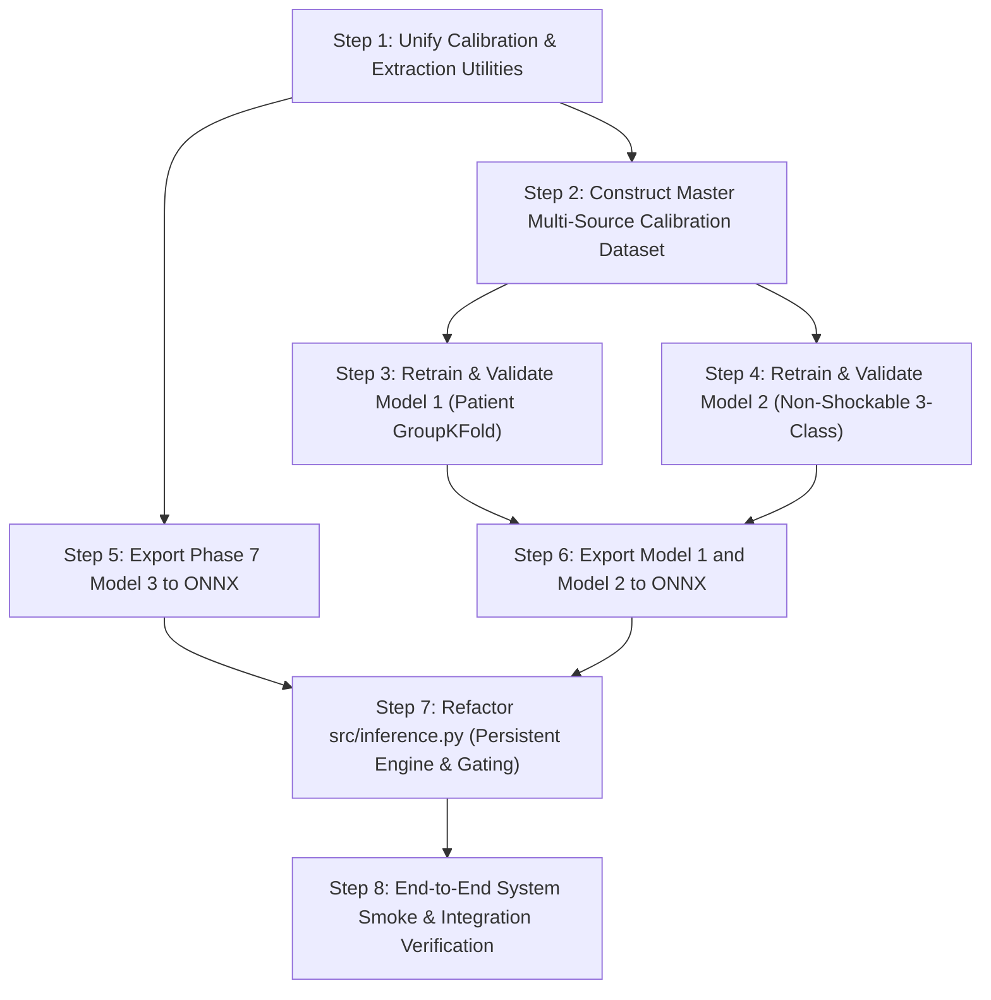

# Final Decision & System Modernization Roadmap

**Date**: September 6, 2026  
**Status**: Recommendation & Decision Framework  
**Scope**: Model 1, Model 2, Model 3, ONNX Edge Deployment, and System Architecture  
**Strict Safety Mode**: No source code, models, or historical artifacts have been modified.  

---

## 1. Master Decision Matrix

| Model / Component | Current Status | Audit Finding | Final Decision | Rationale |
| :--- | :--- | :--- | :---: | :--- |
| **Model 1**<br>*(Shockable Classifier)* | Deployed in `models/`<br>(410 KB ONNX) | **Artificial 99% Accuracy Illusion**.<br>100% source co-extensiveness (Non-Shockable = 100% MIT-BIH; Shockable = 100% VFDB/CUDB). Non-shockable rhythms from VFDB/CUDB dropped. High amplitude leakage. | **RETRAIN**<br>*(Corrected Dataset & Stratified Patient Split)* | Current model is an ECG recording hardware discriminator. Must be retrained on calibrated multi-source non-shockable data (including VFDB/CUDB/C2015 non-shockable intervals) under strict patient-level GroupKFold. |
| **Model 2**<br>*(Multiclass Arrhythmia)* | Deployed in `models/`<br>(3.75 MB ONNX) | **Severe Source Confounding & Alert Deadlocks**.<br>`Tachycardia` is 100% Challenge 2015; `Normal` is 0% C2015. 8x–20x amplitude discrepancy. Catastrophic VF precision (36%, 64% false alarms). Directly conflicts with Model 1 and Model 3. | **RESTRUCTURE TAXONOMY & RETRAIN**<br>*(Non-Shockable Only)* | Remove VF and VT from Model 2 entirely. Restructure Model 2 as an exclusively Non-Shockable 3-class classifier (`Asystole/Brady`, `Normal Sinus`, `Sinus Tachycardia`). Calibrate all input amplitudes to physical mV. |
| **Model 3**<br>*(VT vs. VF Subtype)* | Deployed in `models/`<br>(166 KB ONNX) | **Obsolete Feature Architecture**.<br>Deployed ONNX is the old Phase 4 hand-crafted 10-feature model with known QRS breakdown on VF (D2 AUC = 0.6076). Phase 5–7 validated physiological features have not been exported. | **UPGRADE & EXPORT**<br>*(Phase 7 Physiological Model)* | Replace deployed ONNX with the Phase 7 validated physiological model (Sample Entropy, Lempel-Ziv complexity, Autocorrelation decay, Spectral purity) trained on the expanded 120-record dataset. |
| **Edge Inference**<br>(`src/inference.py`) | Procedural function `classify_window` | **Session Thrashing & Missing Semantics**.<br>Re-loads 4.33 MB of ONNX sessions on every 5-second window. Emits raw ambiguous integers with zero label maps. Parallel uncoordinated execution creates alert contradictions. | **REFACTOR ENGINE**<br>*(Persistent Sessions & Hierarchical Gating)* | Create `ECGInferenceEngine` with persistent sessions. Gate Model 2 and Model 3 hierarchically behind Model 1. Add human-readable label maps and a unified clinical alarm synthesis layer. |

---

## 2. Detailed Decisions per Subsystem

### A. Model 1: Shockable vs. Non-Shockable Gate
- **Verdict**: **RETRAIN REQUIRED**.
- **Dataset Actions**:
  1. Restore non-shockable rhythms from VFDB (NSR, sinus tachycardia, PAC/PVCs) and CUDB.
  2. Incorporate non-shockable windows from Challenge 2015 and MIT-BIH.
  3. Enforce **physical millivolt calibration** on all windows ($mV = (raw - baseline) / gain$).
  4. Perform patient-level GroupKFold splitting ensuring no patient records cross train and validation folds.
- **Feature Pipeline**:
  - Evaluate bandpower ratios (VF band 3–9 Hz vs total power), spectral purity, zero-crossing density, and amplitude statistics.
  - Avoid heavy reliance on narrow Pan-Tompkins QRS width for shockable detection.

### B. Model 2: Multiclass Arrhythmia Classifier
- **Verdict**: **RESTRUCTURE TAXONOMY AND RETRAIN**.
- **Taxonomy Modernization**:
  - **Remove** `Ventricular Fibrillation (VF)` and `Ventricular Tachycardia (VT)`. These lethal shockable rhythms belong strictly to Model 1 and Model 3.
  - **Define Clean Non-Shockable 3-Class Taxonomy**:
    1. `Normal Sinus Rhythm` (NSR)
    2. `Sinus Tachycardia / Supraventricular Tachycardia` (ST/SVT)
    3. `Bradycardia / Asystole / High Pause` (Brady/Asystole)
- **Dataset Actions**:
  - Balance sources across all three classes: do not source Tachycardia exclusively from Challenge 2015. Extract tachycardia segments from MIT-BIH and normal segments from Challenge 2015.
  - Standardize amplitude scaling to eliminate voltage-based separation.

### C. Model 3: Shockable Subtype (VT vs. VF)
- **Verdict**: **UPGRADE TO PHASE 7 PHYSIOLOGICAL MODEL**.
- **Actions**:
  - Discard the obsolete 10-feature XGBoost ONNX model in `models/`.
  - Export the best-performing Phase 7 model trained on the expanded 120-record dataset (`training/model3_phase6/artifacts/expanded_physiological_feature_table.csv`).
  - Input features: Validated physiological complexity and spectral features (Downsampled SampEn, LZ complexity at 90 Hz, dominant peak frequency, autocorrelation decay, spectral purity).
  - Target model: Compact, edge-friendly linear/tree model with calibrated probabilities.

### D. System Architecture & Edge Inference Engine
- **Verdict**: **REFACTOR RUNTIME ARCHITECTURE**.
- **Actions**:
  1. **Hierarchical 2-Tier Decision Tree**:
     ```
     Input Window -> Model 1 (Shockable?)
                         |
         +---------------+---------------+
         | YES                           | NO
         v                               v
     Model 3 (VT vs VF)          Model 2 (NSR / Tachy / Brady)
     ```
  2. **Session Persistence**:
     - Implement `ECGInferenceEngine` class with `__init__` that loads ONNX models once.
     - Eliminate 4.33 MB per-window disk reads.
  3. **Label Mapping & Clinical Synthesis**:
     - Return human-readable labels and probabilities.
     - Return an aggregated `clinical_assessment` object with definitive triage action (`IMMEDIATE_DEFIBRILLATION`, `PREPARE_CARDIOVERSION`, `URGENT_CPR_ASYSTOLE`, `ROUTINE_MONITOR`).

---

## 3. Minimal Necessary Action Items (Pre-Training Checklist)

Before retraining any models or exporting new ONNX binaries, the following discrete tasks must be executed:



### Checklist Details:

1. **Step 1: Calibration & Feature Module Harmonization**
   - Create unified pre-processing script ensuring exact gain/baseline calibration across MIT-BIH, VFDB, CUDB, and Challenge 2015.
   - Separate feature extractors into `extract_morphological_features()` (for Model 1/2) and `extract_physiological_features()` (for Model 3).

2. **Step 2: Master Multi-Source Training Dataset Generation**
   - Build a verified, leakage-free tabular dataset containing record IDs, patient IDs, unified rhythm labels, and calibrated features.
   - Strictly verify that no class is 100% co-extensive with a single database source.

3. **Step 3: Model 1 Retraining & Evaluation**
   - Train a regularized, edge-friendly classifier (e.g., LightGBM / XGBoost with depth $\le 4$ or Regularized Logistic/Ridge).
   - Evaluate under strict patient-level GroupKFold and cross-database holdouts.
   - Target: Shockable sensitivity $> 95\%$, non-shockable specificity $> 95\%$.

4. **Step 4: Model 2 Retraining & Evaluation**
   - Train on the refined 3-class non-shockable taxonomy (`Normal`, `Tachycardia`, `Asystole/Bradycardia`).
   - Eliminate VF and VT from the training target.

5. **Step 5: Model 3 ONNX Export**
   - Convert the Phase 7 physiological VT vs VF classifier to ONNX format matching the new physiological feature schema.

6. **Step 6: Model 1 & 2 ONNX Export**
   - Export newly trained Model 1 and Model 2 to `models/` with embedded metadata and validated ONNX input/output contracts.

7. **Step 7: `src/` Modernization**
   - Refactor `src/inference.py` to provide `ECGInferenceEngine` with persistent sessions, hierarchical routing, and string label dictionaries.
   - Refactor `src/main.py` to output synthesized clinical recommendations.

8. **Step 8: End-to-End Edge Verification**
   - Update `tests/smoke_test.py` and run end-to-end integration tests on sample windows from each class and source.

---

## 4. Proposed Execution Phases

If approved, the implementation will proceed through the following phases:

- **Phase A: Unified Calibration & Multi-Source Dataset Preparation**
  - Extract calibrated windows and features for Model 1 and Model 2 into an isolated staging directory (`training/data_prep/`).
  - Output audit distributions verifying zero class-to-source co-extensiveness.
- **Phase B: Model 1 & Model 2 Controlled Training**
  - Train Model 1 (Shockable Gate) and Model 2 (Non-Shockable 3-Class) under strict patient-grouped validation.
  - Generate full performance reports and confusion matrices.
- **Phase C: ONNX Export & Contract Verification**
  - Export all 3 models to ONNX.
  - Verify tensor dimensions, node counts, and inference latency on CPU.
- **Phase D: Production Code Refactoring & Testing**
  - Refactor `src/features.py`, `src/inference.py`, and `src/main.py`.
  - Update test suite and run comprehensive verification.

---

## 5. Stop & Approval Checkpoint

Per strict safety guidelines, no production code (`src/`), deployed models (`models/`), tests (`tests/`), or historical training phases have been altered.

**All findings, audits, and matrices have been generated and documented in `training/final_model_audit/`.**

**Awaiting user review and explicit approval on the recommended decisions and execution plan before proceeding.**
