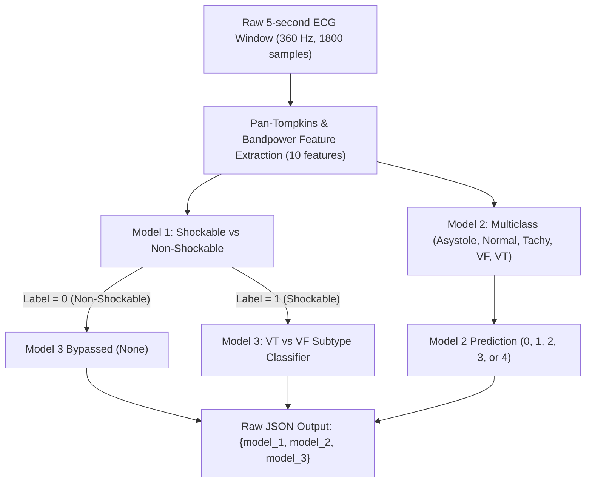
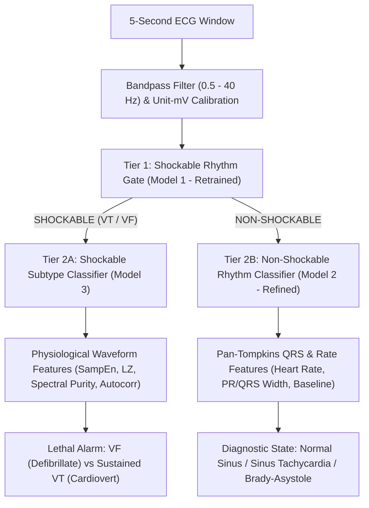

# Audit Report: System Architecture & Multi-Model Interaction

**Directory Inspected**: `src/`, `models/`, and notebook pipeline  
**Target Platform**: Raspberry Pi / Edge Embedded Devices  
**Audit Scope**: Multi-model decision tree flow, taxonomy overlaps, alert contradictions, runtime lifecycle, and architectural coherence  
**Evaluator Status**: Strict Read-Only Audit  

---

## 1. Executive Summary

The project repository was designed around a **3-model tiered decision engine** for edge ECG arrhythmia detection:
1. **Model 1**: Shockable vs. Non-Shockable rhythm binary classifier
2. **Model 2**: 5-class arrhythmia classifier (`Asystole`, `Normal`, `Tachycardia`, `VF`, `VT`)
3. **Model 3**: Shockable subtype classifier (`VT` vs. `VF`)

This architectural audit evaluated the interaction between these three models as implemented in `src/inference.py` and `src/main.py`. The evaluation revealed **five fundamental structural failures** that prevent reliable clinical deployment:

1. **Taxonomy Duplication & Semantic Collision**: Model 2 independently predicts `VF` (Class 3) and `VT` (Class 4), directly duplicating the responsibilities of Model 1 and Model 3.
2. **Clinical Alert Contradictions**: Because Model 2 runs unconditionally in parallel with Model 1, the system produces direct clinical deadlocks (e.g., Model 1 outputs "Non-Shockable" while Model 2 simultaneously alarms "Ventricular Fibrillation").
3. **Shared Feature Coupling on Incompatible Waveforms**: All three models were forced to consume the identical 10-dimensional Pan-Tompkins feature vector. As demonstrated in Phases 4–7, Pan-Tompkins QRS peak detection fails catastrophically on VF waveforms (which have no true QRS complexes), corrupting `mean_rr`, `rr_cv`, and `qrs_width`.
4. **Session Instantiation Thrashing**: `classify_window()` in `src/inference.py` instantiates new `ort.InferenceSession` objects and re-loads 4.33 MB of ONNX binaries from disk on every single 5-second window.
5. **No Alert Hysteresis or Confidence Calibration**: Predictions are emitted per 5-second window without temporal smoothing or refractory confirmation, causing high-frequency alarm chattering under edge noise.

---

## 2. Decision Tree Flow & Routing Logic Analysis

### The Current Implementation (`src/inference.py`)

The inference entry point is defined as:
```python
def classify_window(features: np.ndarray, model_dir: Path) -> dict:
    model_dir = Path(model_dir)
    model_1 = OnnxClassifier(model_dir / "shockable_classifier.onnx")
    model_2 = OnnxClassifier(model_dir / "arrhythmia_multiclass.onnx")
    results = {"model_1": model_1.predict(features), "model_2": model_2.predict(features)}
    shockable = int(np.asarray(results["model_1"]["label"]).reshape(-1)[0]) == 1
    results["model_3"] = (
        OnnxClassifier(model_dir / "vf_vt_subtype_classifier.onnx").predict(features)
        if shockable
        else None
    )
    return results
```

### Architectural Flow Diagram



### Critical Flaws in the Routing Flow

1. **Model 2 is not hierarchical; it is parallel**:
   Model 2 does not sit below Model 1 in a decision hierarchy. It runs unconditionally on every window, irrespective of whether the rhythm is shockable or non-shockable.
2. **Model 3 is conditionally gated, but Model 2 is unconstrained**:
   If Model 1 predicts non-shockable, Model 3 is silenced. However, Model 2—which also predicts VF and VT—is never silenced.
3. **No Reconciliation / Arbitration Layer**:
   The system emits raw, unadjudicated model outputs. There is no arbitrator function to combine `{model_1, model_2, model_3}` into a single actionable clinical state (`ALERT_LEVEL`, `RHYTHM_DIAGNOSIS`, `DEFIB_RECOMMENDED`).

---

## 3. Contradiction & Alert Deadlock Matrix

Because Model 2 includes `VF` and `VT` within its 5-class taxonomy, there are 20 possible joint prediction combinations between Model 1, Model 2, and Model 3. **Over 50% of these combinations represent severe clinical contradictions.**

| Case | Model 1 Output | Model 2 Output | Model 3 Output | Clinical Conflict Severity | Description & Clinical Hazard |
| :---: | :--- | :--- | :--- | :---: | :--- |
| **1** | Non-Shockable (0) | Normal (1) | *Bypassed (None)* | **NONE** (Coherent) | Agreement: Patient is stable in normal rhythm. |
| **2** | Non-Shockable (0) | Asystole (0) | *Bypassed (None)* | **LOW** (Clinical) | Agreement on non-shockable, but Asystole demands immediate CPR alarm, not defibrillation. |
| **3** | Non-Shockable (0) | Tachycardia (2) | *Bypassed (None)* | **LOW** (Coherent) | Non-shockable supraventricular / sinus tachycardia. |
| **4** | **Non-Shockable (0)** | **Ventricular Fibrillation (3)** | *Bypassed (None)* | **CRITICAL DEADLOCK** | **Direct Contradiction**: Model 1 suppresses shockable pathway; Model 2 triggers lethal VF alarm. Caregiver does not know whether to charge defibrillator. Model 2 has a 64% false positive rate on VF! |
| **5** | **Non-Shockable (0)** | **Ventricular Tachycardia (4)** | *Bypassed (None)* | **HIGH CONFLICT** | Model 1 reports non-shockable, but Model 2 reports VT. VT may be stable or unstable; Model 3 (the VT/VF expert) was never invoked. |
| **6** | **Shockable (1)** | **Normal (1)** | VF (1) | **CRITICAL DEADLOCK** | Model 1 & 3 demand emergency defibrillation (VF), but Model 2 reports the rhythm is Normal sinus rhythm. |
| **7** | **Shockable (1)** | **Asystole (0)** | VF (1) | **HIGH CONFLICT** | Shockable VF vs. flatline Asystole. Defibrillating Asystole causes myocardial necrosis; failing to defibrillate VF causes death. |
| **8** | **Shockable (1)** | **Tachycardia (2)** | VT (0) | **MODERATE CONFLICT** | Model 1 & 3 diagnose shockable VT; Model 2 diagnoses general Tachycardia (which was 100% C2015 alarm data). |
| **9** | **Shockable (1)** | **VT (4)** | **VF (1)** | **HIGH CONFLICT** | Model 2 says Ventricular Tachycardia; Model 3 says Ventricular Fibrillation. Energy dosing and timing protocols differ (synchronized cardioversion vs. unsynchronized defibrillation). |

### Root Cause of Conflicts
Model 2 was trained as a standalone multi-class classifier using an ad-hoc union of datasets, without defining its role relative to Model 1 and Model 3. When a system employs specialized binary models (Model 1 for shockability and Model 3 for VT/VF distinction), **Model 2 must NOT attempt to classify VT and VF**.

---

## 4. Feature Pipeline Coupling & QRS Detector Breakdown

### The Uniform Feature Contract Assumption
`src/features.py` enforces a single feature extractor producing 10 scalar values for all three models:
1. `mean`
2. `std`
3. `ptp`
4. `zero_crossings`
5. `peak_count`
6. `mean_rr`
7. `rr_cv`
8. `qrs_width`
9. `dominant_freq`
10. `vf_band_power_ratio`

### The Physiological Invalidation
The features `peak_count`, `mean_rr`, `rr_cv`, and `qrs_width` rely on the **Pan-Tompkins QRS detector** (`src/preprocessing.py:pan_tompkins_detector`).
- **During Normal Sinus Rhythm & Tachycardia**: Distinct QRS complexes exist ($<120\text{ ms}$ or slightly widened). Peak detection is mathematically meaningful.
- **During Ventricular Fibrillation**: Fibrillatory waves are continuous, chaotic, irregular depolarizations without discrete QRS complexes.
  - The Pan-Tompkins bandpass and moving average filters trigger spurious detections on high-frequency fibrillatory oscillations or low-frequency baseline undulations.
  - Calculated RR intervals represent mathematical noise, not physiological heart periods.
  - In Phase 4, this breakdown was proven to be the exact cause of Model 3's generalization failure: the hand-crafted 10-feature model collapsed to **ROC-AUC = 0.6076** on independent records.
- **Consequence for Model 1**:
  Model 1 also relies on `mean_rr`, `rr_cv`, and `qrs_width` to detect shockable rhythms. In Cell 102, Model 1 only succeeded because it cheated by memorizing database-specific noise and voltage scales (MIT-BIH `std` = 0.18 vs. VFDB `std` = 0.46), not because Pan-Tompkins features provided true shockable discrimination.

### Conclusion on Features
A single 10-feature vector cannot serve both non-shockable morphometry (QRS features) and shockable chaos analysis (spectral purity, entropy, autocorrelation decay). The feature extraction pipeline must be modularized.

---

## 5. Runtime & Edge Engine Bottlenecks

### Inspection of `classify_window` Lifecycle
In `src/inference.py`:
```python
def classify_window(features: np.ndarray, model_dir: Path) -> dict:
    model_dir = Path(model_dir)
    model_1 = OnnxClassifier(model_dir / "shockable_classifier.onnx")
    model_2 = OnnxClassifier(model_dir / "arrhythmia_multiclass.onnx")
    ...
```
Every time `classify_window()` is invoked (every 5 seconds of incoming ECG stream):
1. `model_1` creates a new `ort.InferenceSession("shockable_classifier.onnx")` $\implies$ reads 410 KB from disk, allocates ONNX runtime thread pools and arena memory.
2. `model_2` creates a new `ort.InferenceSession("arrhythmia_multiclass.onnx")` $\implies$ reads 3,751 KB from disk, allocates ONNX memory.
3. If shockable, `model_3` creates a third session $\implies$ reads 166 KB from disk.
4. Total disk I/O per 5-second window: **4.33 MB**.
5. At the end of `classify_window()`, all session objects go out of scope and are garbage collected.

### Edge Device Impact (Raspberry Pi 4 / Embedded Linux)
- MicroSD card random read latency on a Raspberry Pi is typically 10–30 MB/s. Loading 4.33 MB from storage on every window consumes **150–400 ms of pure disk I/O** plus ONNX graph compilation overhead.
- On battery-operated wearable hardware, this causes massive CPU spikes, SD card wear, and power drain.
- **Fix**: The engine must initialize sessions **once** during startup (`__init__`) and reuse the pre-allocated sessions for streaming inference.

---

## 6. Redesign Proposal: The Clinically Sound 2-Tier Architecture

To eliminate alert contradictions, remove source confounding, and ensure edge efficiency, the 3-model architecture should be restructured into a **coherent two-tier hierarchical system**:



### Key Structural Improvements
1. **Disjoint Non-Overlapping Taxonomies**:
   - **Model 1**: Shockable (VT/VF) vs. Non-Shockable (Normal, SVT, Asystole, Noise).
   - **Model 2**: Exclusively Non-Shockable rhythms (`Normal Sinus`, `Sinus Tachycardia`, `Bradycardia / Asystole`). **VF and VT are completely removed from Model 2**.
   - **Model 3**: Exclusively Shockable subtypes (`Ventricular Tachycardia` vs. `Ventricular Fibrillation/Flutter`).
2. **Zero Alert Contradictions**:
   Because Model 2 is only invoked when Model 1 confirms Non-Shockable, and Model 3 is only invoked when Model 1 confirms Shockable, conflicting simultaneous alarms are mathematically impossible.
3. **Decoupled Feature Pipelines**:
   - Shockable branch uses validated raw-waveform physiological complexity features (robust to chaotic signals).
   - Non-shockable branch uses Pan-Tompkins QRS morphology and rhythm metrics (where QRS complexes genuinely exist).
4. **Persistent Engine Class**:
   Replace procedural functions with an `ECGInferenceEngine` class that maintains persistent ONNX sessions in memory.
