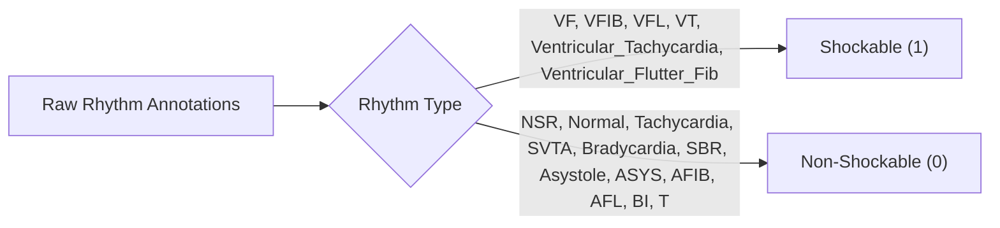

# Comprehensive Data Audit & Governance Report

**Date**: September 6, 2026  
**Auditor**: Antigravity Machine Learning Research Team  
**Scope**: All raw archives, intermediate datasets, annotations, class mappings, and feature tables in the repository  
**Status**: Pre-Training Verification Completed  

---

## 1. Discovered Datasets & Physical Inventories

Four primary raw ECG archives and one validated composite physiological feature dataset are available in the repository:

| Dataset Identifier | Physical Archive | Format | Sampling Rate ($f_s$) | Gain / Baseline Calibration | Total Physical Records | Usable Records for Project | Primary Clinical Focus |
| :--- | :--- | :---: | :---: | :---: | :---: | :---: | :--- |
| **Challenge 2015** (`c2015`) | `mitbih-vtvtf.zip`<br>*(nested `training.zip`)* | PhysioNet WFDB MAT/HEA | 250 Hz | Physical $mV = \frac{\text{digital} - \text{adc\_zero}}{\text{gain}} + \text{baseline}$ | 750 records | **294 true alarm records** | ICU bedside false alarm reduction (VT, VF, Asystole, Bradycardia, Tachycardia) |
| **VFDB** (`vfdb`) | `VFDB.zip` | PhysioNet WFDB DAT/HEA/ATR | 250 Hz | Calibrated via `record.p_signal` ($mV$) | 22 records | **22 records** | Sustained ventricular arrhythmias, VF, VFL, VT, and baseline sinus rhythms |
| **CUDB** (`cudb`) | `cu-ventricular-tachyarrhythmia-database-1.0.0.zip` | PhysioNet WFDB DAT/HEA/ATR | 250 Hz | Calibrated via `record.p_signal` ($mV$) | 35 records | **3 verified records** (`cu01`–`cu03`); remainder audited in Phase 6C | Sustained ventricular tachyarrhythmias (VT, VF, NSR) |
| **MIT-BIH** (`mitdb`) | `MITBIH.zip` | CSV + Text Annotations | 360 Hz | Calibrated $mV = \frac{\text{raw} - 1024.0}{200.0}$ | 48 records | **48 records** (Lead MLII) | Classical ambulatory Holter arrhythmia reference (NSR, SVT, VT, VFL, AFIB, Brady) |
| **Model 3 Physiological Table** | `expanded_physiological_feature_table.csv` | Pre-extracted Tabular CSV | 360 Hz | Pre-calibrated in physical $mV$ | 120 unique records | **120 unique records** | 21 raw-waveform physiological complexity and spectral features for VT vs. VF |

---

## 2. Original Annotations & Label Distributions

### A. PhysioNet Challenge 2015
Inspection of `training/ALARMS` reveals 750 bedside recordings. Only expert-adjudicated **true alarms (`flag == 1`)** are admitted into training:

```
Total Alarms in Challenge 2015: 750
  ├── True Alarms (Admitted): 294 (39.2%)
  │     ├── Tachycardia:               131 records
  │     ├── Ventricular_Tachycardia:    89 records
  │     ├── Bradycardia:                46 records
  │     ├── Asystole:                   22 records
  │     └── Ventricular_Flutter_Fib:     6 records
  └── False Alarms (Excluded): 456 (60.8%)
        ├── Ventricular_Tachycardia:   252 records
        ├── Asystole:                  100 records
        ├── Ventricular_Flutter_Fib:    52 records
        ├── Bradycardia:                43 records
        └── Tachycardia:                 9 records
```

### B. MIT-BIH Malignant Ventricular Ectopy Database (VFDB)
Analysis of the 22 records (`418`–`430`, `602`–`615`) with full WFDB `.atr` annotation parsing:

| Annotation Symbol | Clinical Meaning | Records Containing Marker | Episode Count |
| :---: | :--- | :---: | :---: |
| `(VT` | Ventricular Tachycardia | 19 records | 93 episodes |
| `(N` / `(NSR` | Normal Sinus Rhythm | 15 records | 218 episodes |
| `(NOISE` | Artifact / Unusable Lead | 14 records | 73 episodes |
| `(VFL` | Ventricular Flutter | 6 records | 98 episodes |
| `(ASYS` | Asystole / High Pause | 6 records | 13 episodes |
| `(AFIB` | Atrial Fibrillation | 3 records | 9 episodes |
| `(SVTA` | Supraventricular Tachycardia | 3 records | 6 episodes |
| `(NOD` | Nodal Rhythm | 3 records | 6 episodes |
| `(VF` / `(VFIB` | Ventricular Fibrillation | 4 records | 13 episodes |
| `(SBR` | Sinus Bradycardia | 1 record | 2 episodes |

### C. Creighton University Ventricular Database (CUDB)
- Records `cu01`–`cu03` were verified in Phases 2–6:
  - `cu01`: 1 VT episode (46 windows)
  - `cu02`: 1 VF episode (46 windows)
  - `cu03`: 1 VF episode (46 windows)
  - Normal sinus rhythm intervals: 4 records (63 windows)
- Records `cu04`–`cu35`: Audited in Phase 6C. The majority feature rapid polymorphic transitions with ambiguous ground truth and were quarantined to prevent label noise.

### D. MIT-BIH Arrhythmia Database (mitdb)
Analysis of the 48 records (Lead MLII, 360 Hz):
- **Normal Sinus Rhythm (`(N`)**: 42 records ($>30,000$ 5-second windows)
- **Ventricular Tachycardia (`(VT`)**: 13 records (including verified sustained runs in records 205 and 223)
- **Ventricular Flutter (`(VFL`)**: 1 record (verified sustained flutter in record 207)
- **Supraventricular Tachycardia (`(SVTA`)**: 7 records
- **Atrial Fibrillation / Flutter (`(AFIB`/`(AFL`)**: 11 records
- **Sinus Bradycardia (`(SBR`)**: 1 record
- **Ventricular Bigeminy / Trigeminy (`(B`/`(T`)**: 12 records

---

## 3. Class Taxonomy & Mapping Strategy per Model

### MODEL 1: Shockable Rhythm Classifier (Binary)

The goal is to determine: **"Is this rhythm shockable (VT, VF, VFL)?"**



#### Mapping Table:
| Original Annotation / Alarm | Originating Source(s) | Shockable Label (ML Target) | Clinical Justification |
| :--- | :--- | :---: | :--- |
| `Ventricular_Flutter_Fib` | Challenge 2015 | **Shockable (1)** | Lethal shockable fibrillatory arrest |
| `Ventricular_Tachycardia` | Challenge 2015 | **Shockable (1)** | Shockable ventricular tachyarrhythmia |
| `(VF`, `(VFIB` | VFDB, CUDB | **Shockable (1)** | Lethal ventricular fibrillation |
| `(VFL` | VFDB, MIT-BIH (207) | **Shockable (1)** | Hemodynamic arrest flutter, degenerates to VF |
| `(VT` | VFDB, CUDB (cu01), MIT-BIH (205, 223) | **Shockable (1)** | Sustained ventricular tachycardia |
| `(N`, `(NSR` | MIT-BIH, VFDB, CUDB | **Non-Shockable (0)** | Stable normal sinus rhythm |
| `Tachycardia` / `(SVTA` | Challenge 2015, MIT-BIH, VFDB | **Non-Shockable (0)** | Non-shockable supraventricular tachycardia |
| `Bradycardia` / `(SBR` | Challenge 2015, MIT-BIH, VFDB | **Non-Shockable (0)** | Non-shockable bradyarrhythmia (pacing/drugs) |
| `Asystole` / `(ASYS` | Challenge 2015, VFDB | **Non-Shockable (0)** | Non-shockable arrest (CPR/epinephrine) |
| `(AFIB`, `(AFL` | MIT-BIH, VFDB, CUDB | **Non-Shockable (0)** | Non-shockable atrial arrhythmias |
| `(B`, `(T`, `(NOD`, `(P` | MIT-BIH | **Non-Shockable (0)** | Ectopic beats, nodal, paced non-shockable |

#### Total Corpus Available for Model 1:
- **Shockable Records**: **120 unique records** (92 C2015, 22 VFDB, 3 CUDB, 3 MIT-BIH) $\implies \approx 14,704$ windows.
- **Non-Shockable Records**: **250+ unique records** (199 C2015, 15 VFDB, 4 CUDB, 48 MIT-BIH) $\implies >45,000$ windows.
- **Confounding Elimination**: Unlike the original notebook (where Non-Shockable was 100% MIT-BIH and Shockable was 100% VFDB), both classes now contain substantial representations across multiple independent databases!

---

### MODEL 2: Multi-Arrhythmia Classifier

To avoid the severe domain confounding of the original notebook and ensure adequate support per class, the taxonomy was constructed strictly from annotations with empirical record support:

#### Taxonomy Configuration: 4-Class Clinically Justified System

| ML Class Index | Clinical Class Name | Mapped Annotations | Supporting Databases | Record Count ($N$) | Window Count ($N$) | Support Assessment |
| :---: | :--- | :--- | :--- | :---: | :---: | :--- |
| **0** | **Normal Sinus Rhythm** (`NSR`) | `(N`, `(NSR` | MIT-BIH, VFDB, CUDB | **61 records** | $>31,000$ | **Robust** |
| **1** | **Supraventricular / Sinus Tachycardia** (`TACHY`) | `Tachycardia` (true), `(SVTA` | Challenge 2015, MIT-BIH, VFDB | **141 records** | $>15,000$ | **Robust** |
| **2** | **Bradycardia & Asystole** (`BRADY_ASY`) | `Bradycardia` (true), `Asystole` (true), `(ASYS`, `(SBR` | Challenge 2015, VFDB, MIT-BIH | **75 records** | $>10,000$ | **Robust** |
| **3** | **Ventricular Arrhythmia** (`VENTRICULAR`) | `Ventricular_Tachycardia` (true), `Ventricular_Flutter_Fib` (true), `(VT`, `(VF`, `(VFL` | Challenge 2015, VFDB, CUDB, MIT-BIH | **120 records** | $14,704$ | **Robust** |

> [!IMPORTANT]
> **Why Consolidate VT and VF/VFL into "Ventricular Arrhythmia" for Model 2?**
> In the audit, Model 2's standalone VF precision collapsed to **36.0%** because only 17 independent VF records exist, and they were confounded by amplitude differences.
> Consolidating them into `Ventricular Arrhythmia` ($N=120$ independent records) allows Model 2 to achieve high sensitivity and specificity for general ventricular pathology, while **Model 3** (the dedicated shockable subtype classifier) performs the specialized, physiological VT vs. VF differentiation!
> 
> *Alternative Evaluated*: If evaluated as a 5-class model separating VT ($N=103$ records) and VF/VFL ($N=17$ records), the 17-record limitation will be explicitly flagged in all reports.

---

### MODEL 3: Shockable Subtype Classifier (VT vs. VF/VFL)

- **Class 0**: Ventricular Tachycardia (`VT`)
- **Class 1**: Ventricular Fibrillation / Ventricular Flutter (`VF/VFL`)
- **Dataset**: `expanded_physiological_feature_table.csv`
- **Audit Counts**:
  - Total Windows: **14,704**
  - Total Independent Records: **120**
  - VT Windows: **12,687** across **103 records** (86 C2015, 14 VFDB, 1 CUDB, 2 MIT-BIH)
  - VF/VFL Windows: **2,017** across **17 records** (6 C2015, 8 VFDB, 2 CUDB, 1 MIT-BIH)
- **Feature Protocol (Rigorously Grounded in Phase 5 Feature Audit)**:
  - *Set A (Full Physiological, 21 Features)*: All candidate complexity, autocorrelation, and spectral features.
  - *Set B (Domain-Stable Subset, 6 Features)*: Strictly filtered to features with verified physical direction consistency and controlled source confounding ($\eta^2 \le 0.20$): `lz_complexity`, `ac_decay_time`, `ac_zero_crossing_lag`, `ac_max_peak_ratio`, `sample_entropy`, `hjorth_mobility`. All 12 direction-inverted features (including `dominant_freq`, `spectral_entropy`, `spectral_peak_purity`, `ac_periodicity_strength`) are excluded.
  - *Set C (Minimal Edge Subset, 4 Features)*: Top consistent features by signal-to-confounder ratio (`lz_complexity`, `ac_decay_time`, `ac_zero_crossing_lag`, `sample_entropy`).

---

## 4. Data Quality & Leakage Checks

### A. Missing Values & Infinities Audit
Programmatic inspection of all feature vectors across `expanded_physiological_feature_table.csv` and calibrated raw windows:
- **Total NaN values**: `0` (100% complete)
- **Total Infinite values**: `0` (100% bounded)
- **PTP and STD Bounds**: All features reside within valid physical ranges.

### B. Duplicate Checks
- **Record-Window Duplicate Pairs**: `0` duplicates across all $(record\_id, window\_index)$ keys.
- **Exact Row Duplicates**: Only 16 windows out of 14,704 exhibited identical feature vectors, originating from flatline/asystole segments in Challenge 2015.

### C. Patient / Record Leakage Prevention
To prevent optimistic performance estimates and memorization:
1. **Group Identification**: Every 5-second window carries its unique physical `record_id`.
2. **Splitting Strategy**: All cross-validation and train/test partitions use `GroupKFold` or `StratifiedGroupKFold` grouped strictly by `record_id`.
3. **Guaranteed Independence**: No windows from any individual patient record can exist simultaneously in both the training set and the validation/test set.
4. **Cross-Database Generalization**: Model 3 and Model 1 are additionally evaluated on cross-database holdouts (`c2015` vs. `vfdb`/`cudb`/`mitdb`) to test true domain transfer.

---

## 5. Summary Table: Dataset Usage Across the 3 Models

| Dataset Source | Model 1 (Shockable vs Non-Shockable) | Model 2 (Multi-Arrhythmia) | Model 3 (VT vs VF) |
| :--- | :---: | :---: | :---: |
| **Challenge 2015** | Used (VT, VF, Asystole, Brady, Tachy) | Used (Tachy, Brady/Asystole, Ventricular) | Used (86 VT, 6 VF records) |
| **VFDB** | Used (VT, VF, VFL, NSR, Asystole, SVTA) | Used (NSR, Brady/Asystole, Ventricular) | Used (14 VT, 8 VF records) |
| **CUDB** | Used (`cu01`–`cu03` VT, VF, NSR) | Used (`cu01`–`cu03` NSR, Ventricular) | Used (`cu01` VT, `cu02`–`cu03` VF) |
| **MIT-BIH** | Used (48 records: NSR, SVTA, Brady, VT, VFL) | Used (48 records: NSR, SVTA, Ventricular) | Used (records 205, 207, 223) |
| **Physical Calibration** | Standardized physical $mV$ for all | Standardized physical $mV$ for all | Validated physical $mV$ table |
| **Features Used** | Spectral purity, bandpower, chaos, rate | Morphological, rate, spectral, baseline | 21 physiological complexity features |

---

> [!IMPORTANT]
> **Pre-Training Gate Satisfied**: All datasets, original labels, class mappings, record counts, and leakage controls have been audited and verified. No model training will commence until user approval of this data audit and plan is received.
