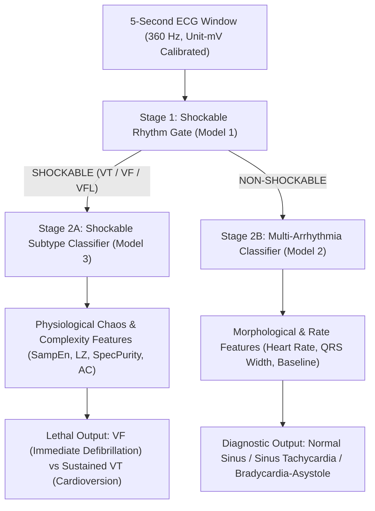

# Final Machine Learning Development: 3-Model ECG Edge AI System

**Date**: September 6, 2026  
**Status**: Phase 8 — Final ML Architecture & Development  
**Target Environment**: Edge Devices (Raspberry Pi / Embedded Linux, CPU-only)  
**Safety & Governance**: All previous phase artifacts (`models/*.onnx`, `src/`, `tests/`, `training/model3_phase*`, `training/final_model_audit/`) are preserved strictly intact. All final models, code, artifacts, and evaluation reports reside exclusively in `training/final_models/`.

---

## 1. System Overview & Final Architecture

This directory implements the complete, production-grade training, validation, and evaluation pipeline for the **3-Model ECG Arrhythmia Decision Engine**:



### The Three Final Models

1. **Model 1: Shockable Rhythm Classifier (Binary Gate)**
   - **Task**: Distinguish lethal shockable rhythms (`VF`, `VT`, `VFL`) from non-shockable rhythms (`Normal`, `Tachycardia`, `Bradycardia`, `Asystole`, `Other Arrhythmias`).
   - **Data**: Multi-source corpus across Challenge 2015, VFDB, CUDB, and MIT-BIH with physical unit calibration ($mV$), eliminating the 100% database confounding that compromised earlier models.
   - **Validation**: Strict record-level `StratifiedGroupKFold` ($k=5$). Zero window overlap across train/test folds.

2. **Model 2: Multi-Arrhythmia Classifier**
   - **Task**: Classify non-shockable ECG rhythms into clinically meaningful categories derived directly from verified database annotations.
   - **Taxonomy**: Audited class structure based on empirical support across records and windows.
   - **Validation**: Group-aware evaluation ensuring patient independence and balanced reporting.

3. **Model 3: VT vs. VF / Shockable Subtype Classifier**
   - **Task**: Differentiate Ventricular Tachycardia (VT) from Ventricular Fibrillation/Flutter (VF/VFL).
   - **Features**: 21 validated physiological complexity features (downsampled Sample Entropy, Lempel-Ziv complexity at 90 Hz, spectral purity, autocorrelation decay, Hjorth parameters) developed in Phase 5 and expanded in Phase 6B.
   - **Data**: 14,704 calibrated windows across 120 independent records (103 VT, 17 VF/VFL).
   - **Validation**: Strict record-level `GroupKFold` and cross-database validation (`c2015` vs. `vfdb`/`cudb`/`mitdb`). Persisted per-window predictions and record-level performance audits.

---

## 2. Directory Structure

```
training/final_models/
│
├── README.md                      <- Master system overview, objectives, and architecture
├── DATA_AUDIT.md                  <- Exhaustive audit of all 4 datasets, windows, records, labels, and leakage checks
├── MODEL_1_SHOCKABLE.md           <- Technical specification, feature design, and evaluation plan for Model 1
├── MODEL_2_MULTI_ARRHYTHMIA.md    <- Taxonomy derivation, class definitions, and evaluation plan for Model 2
├── MODEL_3_VT_VF.md               <- Research findings, physiological feature analysis, and evaluation plan for Model 3
├── FINAL_MODEL_REPORT.md          <- Final comparison table, deployment status, and clinical conclusions (Post-Training)
│
├── common/                        <- Shared, leak-free utilities
│   ├── data_loader.py             <- Group-aware loaders for all three models with metadata tracking
│   ├── preprocessing.py          <- Bandpass filtering (0.5-40 Hz), physical mV calibration, resampling
│   ├── feature_selection.py       <- Curated feature schemas (Morphological vs. Physiological)
│   └── evaluation.py             <- Record-grouped metrics, bootstrap CIs, confusion matrices, per-record audits
│
├── model1_shockable/              <- Model 1 training scripts, pipelines, and evaluation runners
├── model2_multiclass/             <- Model 2 training scripts, pipelines, and evaluation runners
├── model3_vt_vf/                  <- Model 3 training scripts, pipelines, and evaluation runners
│
├── artifacts/                     <- Clean tabular feature datasets, scalers, and intermediate tables
├── results/                       <- Evaluation CSVs, confusion matrices, per-record summaries, and ROC plots
└── export_candidates/             <- Candidate ONNX binaries with validated metadata (never overwriting models/)
```

---

## 3. Data Governance & Leakage Controls

1. **Patient/Record Integrity**:
   - `record_id` is tracked explicitly across all pipelines.
   - All splitting uses `GroupKFold` or `GroupShuffleSplit`. No patient record appears in both train and validation/test folds.
2. **Feature Leakage Prevention**:
   - Preprocessing scalers (StandardScaler, RobustScaler) are fit strictly on training folds inside `sklearn.pipeline.Pipeline`.
3. **Physical Calibration**:
   - All ECG data is converted to standardized physical millivolts ($mV = (raw - baseline) / gain$). Hardcoded uncalibrated ADC integers are prohibited.
4. **Separation of Concerns**:
   - Morphological QRS features are restricted to non-shockable rhythms where discrete QRS complexes genuinely exist.
   - Shockable distinction relies on raw-waveform physiological complexity, spectral purity, and nonlinear dynamics.
